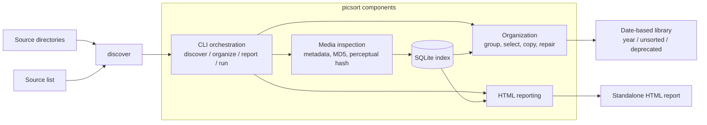

# picsort

`picsort` scans large image collections, records durable metadata in SQLite, groups exact and visually similar images, and copies the best candidate into a date-based library. Source files are never modified.

## Setup

Use Python 3.10 or newer. The repository setup installs the core dependencies, all three optional media dependencies (HEIC, RAW, and video), and development tools:

```bash
python3 -m venv venv
source ./venv/bin/activate
pip3 install -r requirements.txt
```

For a minimal editable installation instead, install the core package and select only the extras you need:

```bash
pip3 install -e .                    # Core image formats
pip3 install -e '.[heic,raw,video]'   # All optional media dependencies
```

### Decoders and recognized formats

Discovery filters by file extension (case-insensitive). Installing a decoder does not expand this list; a recognized extension also does not guarantee that a particular file can be read.

| Media | Recognized extensions | Dependency / extra |
| --- | --- | --- |
| Standard images | `.jpg`, `.jpeg`, `.png`, `.gif`, `.tif`, `.tiff`, `.webp` | `Pillow>=10.0` (core) |
| HEIC images | `.heic` | `pillow-heif>=0.16` / `heic` |
| Camera RAW | `.raw`, `.cr2`, `.cr3`, `.nef`, `.arw`, `.dng`, `.raf`, `.orf`, `.rw2`, `.pef` | `rawpy>=0.19` / `raw` |
| Video (with `--videos`) | `.mp4`, `.mov`, `.m4v`, `.avi`, `.mkv`, `.webm`, `.dv` | PyAV (`av>=12.0`) / `video` |

HEIC originals, including the still-image component of Live Photos, use the Pillow opener registered by `pillow-heif`. `.heif` and `.avif` are not currently included in discovery.

Camera RAW support depends on the formats handled by the installed `rawpy`/LibRaw decoder. Inspection uses an 8-bit, half-size rendered image for dimensions, perceptual hashing, and sharpness. The current RAW path does not transfer capture-date metadata into that rendered image, so RAW files normally go under `unsorted`. Organized originals are still copied byte-for-byte.

Video inspection uses PyAV to read container and stream metadata; it does not decode frames for visual duplicate detection. The application does not invoke the `ffmpeg` or `ffprobe` command-line tools.

Missing dependencies and unsupported or corrupt files are recorded as per-file errors without stopping discovery. Unchanged image files with recorded errors are skipped on later scans, even after installing a decoder. There is currently no force-retry flag: to recheck them without modifying source files or the existing index, run discovery with a new index path. A rerun using the existing index retries a file when its size or modification time changes.

## Workflow



Discovery is resumable and may be rerun after an interruption:

```bash
./bin/picsort discover /Photos --index /Library/.picsort.sqlite --workers 8
./bin/picsort organize --index /Library/.picsort.sqlite --destination /Library --workers 8 --dry-run
./bin/picsort organize --index /Library/.picsort.sqlite --destination /Library --workers 8
./bin/picsort report --index /Library/.picsort.sqlite --output /Library/index.html
```

For multiple input directories, put one directory per line in a text file. Blank lines and lines beginning with `#` are ignored:

```text
/Volumes/Camera A/DCIM
/Volumes/Camera B/DCIM
# /Volumes/Archive/old-photos
```

Then use the list with `discover` or `run`:

```bash
./bin/picsort discover --source-list sources.txt --index /Library/.picsort.sqlite
./bin/picsort run --source-list sources.txt --index /Library/.picsort.sqlite --destination /Library
```

To run all three phases in sequence, use `run`. The organize phase processes only the selected media type and the source roots supplied to that `run` invocation; standalone `organize` processes the selected media type across the whole index. The report defaults to `DESTINATION/index.html`:

```bash
./bin/picsort run /Photos \
  --index /Library/.picsort.sqlite \
  --destination /Library \
  --workers 8 \
  --dry-run
```

Videos are opt-in and exclusive. PyAV is included in the repository setup above; for a minimal installation, add it with `pip3 install -e '.[video]'`. Use `--videos` to process only video clips:

```bash
./bin/picsort run /Videos --videos \
  --index /Library/.picsort.sqlite \
  --destination /Library \
  --workers 8
```

Supported video extensions are `mp4`, `mov`, `m4v`, `avi`, `mkv`, `webm`, and `dv`. Video duplicates use exact MD5 matching and are copied byte-for-byte. Embedded container dates are used for year folders. DV captures without an embedded date also recognize the strict `dvgrab-YYYY.MM.DD_HH-MM-SS.dv` naming convention. Missing dates and epoch dates go under `unsorted`.

Add `-v` or `--verbose` to any command to print each processed file or report stage. Without verbose mode, `discover` and `organize` show a live progress bar with completed count, processing rate, and estimated time remaining. For example:

```bash
./bin/picsort discover /Photos --index /Library/.picsort.sqlite --workers 8 --verbose
./bin/picsort organize --index /Library/.picsort.sqlite --destination /Library --workers 8 --dry-run
```

At the end of organization, picsort prints the number of files copied into each destination folder. Dry runs print the corresponding planned additions; existing files reported as skipped are not included.

Image capture dates prefer EXIF `DateTimeOriginal`, then `DateTimeDigitized`, then the top-level `DateTime` modification value. To repair an existing destination after upgrading, preview and apply a destination-wide metadata rescan with:

```bash
./bin/picsort organize --index /Library/.picsort.sqlite --destination /Library --repair-dates --dry-run
./bin/picsort organize --index /Library/.picsort.sqlite --destination /Library --repair-dates
```

Date repair includes managed images in year folders and `unsorted`, but skips the entire `deprecated` subtree. It updates matching index rows and moves incorrectly dated files without overwriting existing targets. Unindexed destination files are reported and left unchanged.
While repairing, picsort first shows a destination-scanning spinner and then a progress bar with the exact number of candidate images, processing rate, and ETA. Use `--verbose` for per-file repair outcomes or `--quiet` to suppress both stages.

`discover` and `run` show directory and entry counts, matching-file counts, elapsed time, and scan rate by default while the source directory is being enumerated. The exact total and ETA become available once enumeration finishes. Use `-q` or `--quiet` to suppress live status output. Source and per-file errors remain visible on stderr:

```bash
./bin/picsort discover /Photos --index /Library/.picsort.sqlite --quiet
```

Selected files are byte-for-byte copies named `YYYY-MM-DD-<md5>.<ext>`, with canonical extensions (`jpg` and `jpeg` become `jpeg`, `tif` and `tiff` become `tiff`, and `heic` remains `heic`). EXIF capture dates produce a `YYYY` folder; images without a valid EXIF date, or with years 0000, 1969, or 1970, go under `unsorted` and use the `0000-00-00` filename prefix. Existing destination files are never replaced. During `organize`, files previously generated with shortened `.jpg`, `.tif`, or `.hei` extensions are safely renamed to `.jpeg`, `.tiff`, or `.heic`; existing targets are never overwritten, and `--dry-run` previews these renames.

If a later discovery finds a perceptual match with strictly greater pixel area, `organize` copies the higher-resolution image and moves the previously organized lower-resolution file under `DESTINATION/deprecated`, preserving its relative path and year folder. Deprecated files are never overwritten. Use `--dry-run` to preview both the new copy and the deprecation without changing the library or index.

Discovery ignores common thumbnail names such as `thumb`, `thumbnail`, `preview`, `small`, and `icon`. Add `--ignore-pattern` to provide regular expressions. Use `--phash-threshold` on `organize` to tune visually similar grouping; the default is conservative.

Run `./bin/picsort --help` or `./bin/picsort <command> --help` for complete usage. `--workers N` controls parallel metadata inspection during discovery and parallel byte-for-byte copying during organization. `--dry-run` reports planned organization without changing the destination or index.

The report is a standalone HTML file with totals, formats, EXIF date summaries, duplicate/error counts, and relative links to generated destination folders. Organized-file totals, formats, dates, and folder links include only existing files under the report's library root, which defaults to the HTML file's parent directory. If the report is written elsewhere, pass `--destination /Library` to set the library root explicitly. Missing EXIF dates and years 0000, 1969, and 1970 are grouped as `unsorted`.

Discovery fingerprints each file using its size and modification time before reading it. Unchanged files are skipped, so rerunning a scan does not reread the existing library.

Invalid, missing, unreadable, and non-UTF-8 source paths are reported as source errors and skipped. Files found during a partially readable scan are indexed, but existing entries are marked stale only after the entire source root is scanned successfully. If validation leaves no valid source roots, discovery exits without modifying the index.

## Development

Run tests with `pytest`. Run `ruff check .` and `ruff format --check .` before submitting changes. Tests use temporary image libraries and must not depend on personal photo data.

## Repairing video references and duplicate counts

Video discovery checks MOV, MP4, and M4V container references before opening them
with PyAV. Movies referencing external media are indexed as `excluded` with reason
`external_reference`, so they are never copied as independent clips. This includes
iPhoto reference previews even when they have ordinary camera filenames. Folder
names and file size are not exclusion criteria. Zlib-compressed QuickTime metadata is inspected with a 16 MiB expansion limit.
Unsupported compression or malformed metadata is reported as a per-file error.

Video organization groups exact MD5 matches, keeps an existing representative when
available, and marks other sources as duplicates pointing to that file. It does not
compare re-encoded video content. Reports count each active destination file once.

Preview repair of an existing library (no index or library changes):

```bash
./bin/picsort repair-videos --index vidlib/idx.sqlite \
  --destination /Volumes/SD4TB/vidlib
```

The command prints a text summary and sends file errors to stderr. Add `--verbose`
to list individual reference-file paths. The recovery manifest remains JSON.

Apply the repair:

```bash
./bin/picsort repair-videos --index vidlib/idx.sqlite \
  --destination /Volumes/SD4TB/vidlib --apply
```

Repair inspects indexed destinations directly, so original source drives need not
be mounted. It verifies each reference movie's hash, then moves it under
`deprecated/reference-videos/`, preserving its relative path. Original source
files are never changed. All index entries sharing the quarantined path become
excluded. It also reconciles exact-duplicate statuses and regenerates the library's
`index.html`. Multiple physical destinations for one hash are reported for review
and left in place. Unverifiable, missing, changed, or conflicting files are reported
and left untouched. Run repair while other picsort processes are stopped.

Each apply creates an SQLite backup next to the index and saves a move manifest at
`DESTINATION/.picsort-reference-repair.json`. Keep both for recovery. Rerun the same
command after interruption to finish recorded moves; do not remove the manifest.
Quarantine preserves the reference files, and the manifest records their original
paths and affected index row IDs. To undo a repair, stop picsort, move quarantined
files back only where their original paths are empty, and restore the corresponding
pre-repair index backup (restoring a backup also undoes later index changes).

Existing video inspections receive the new reference check once on discovery or
organization. Run repair first to clean up an existing destination and validate
its indexed videos without rereading unavailable source libraries.
